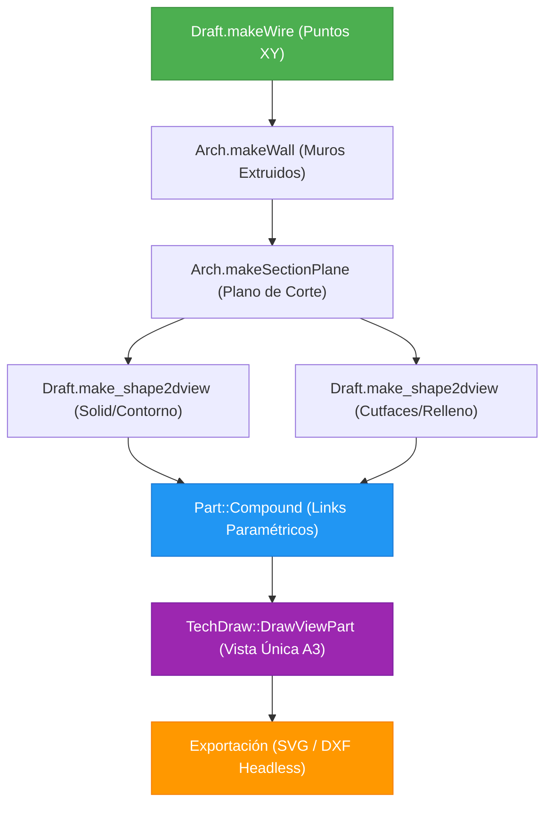

# 🔧 freecad-engineering — Plugin para Antigravity CLI

[](LICENSE)
[](https://antigravity.dev)
[](https://www.freecad.org)

Plugin de [Antigravity CLI](https://antigravity.dev) que extiende al agente con una **guía de referencia completa y validada** para automatización y modelado paramétrico avanzado en FreeCAD mediante Python en modo headless (`FreeCADCmd`).

> [!WARNING]
> **Proyecto en Desarrollo:** Este plugin y su documentación asociada se encuentran en fase activa de desarrollo. Pueden existir fallas no previstas, cambios de API en versiones futuras de FreeCAD o comportamientos inesperados dependiendo del entorno de ejecución.

---

## 🗺️ Mapa de Contenidos (SKILL.md)

La guía en [SKILL.md](skills/freecad-guide/SKILL.md) está estructurada en 14 secciones críticas que cubren flujos de trabajo de ingeniería y arquitectura:

| Sección | Eje Temático | Conceptos Clave |
| :---: | :--- | :--- |
| **1** | **Modelado Paramétrico via Sketcher** | Mapeo XY seguro, restricciones complejas, API de bocetos |
| **2** | **Tablas de Ingeniería (Spreadsheet)** | Fórmulas con `=`, evaluación de celdas bidireccional en Python |
| **3** | **TechDraw Inteligente** | Generación de vistas automáticas en planos SVG/DXF, templates |
| **4** | **Ejecución FEM Headless** | Mallas Netgen síncronas, configuración de límites de borde |
| **5** | **Solver CalculiX (ccx)** | Definición estructural, cargas de fuerza, extracción de datos |
| **6** | **Ensamblajes con A2plus** | Mockeo de GUI/PySide, restricciones axiales, resolución síncrona |
| **7** | **Addons Mecánicos (FCGear)** | Mapeo en entornos Flatpak, engranajes involucutos, distancia entre centros |
| **8** | **Elementos de Unión (Fasteners)** | Creación física de roscado, asignación de diámetro/longitud en C++ |
| **9** | **Animaciones Mecánicas** | Expresiones de rotación, temporizadores QTimer para macros de animación |
| **10** | **Validación CAD (STEP / STL)** | Exportación neutra, conversión Mesh a poligonal, validación de manifolds |
| **11** | **Telemetría y Diagnóstico** | Logs de depuración en consola, parser regex de alertas/errores |
| **12** | **Parches en Entornos Sandbox** | Monkey-patching de parámetros obsoletos o incompatibles con Flatpak |
| **13** | **Simulación FEM con Subprocesos** | Aislamiento de crashes fatales en C++ (`SMESH`), parser FRD en Python puro |
| **14** | **Modelado BIM y Arquitectónico** | Jerarquías IFC, muros robustos, arcos 2D, evitar descuadre en TechDraw |

---

## 🛠️ Flujo de Trabajo Validado para BIM (Sección 14)

El siguiente diagrama detalla la arquitectura de generación paramétrica de planos y modelos 2D/3D libre de errores de bounding box:



---

## 🚀 Instalación y Uso

### Opción 1: Instalar directamente mediante Antigravity CLI (Recomendado)
Puedes instalar el plugin ejecutando el comando de instalación directamente en tu terminal:
```bash
agy plugin install git@github.com:AsterrZep/freecad-engineering.git
```

### Opción 2: Instalación manual (Git Clone)
Si lo prefieres, puedes clonar manualmente el repositorio dentro del directorio de plugins de Antigravity:
```bash
git clone git@github.com:AsterrZep/freecad-engineering.git \
  ~/.gemini/config/plugins/freecad-engineering
```

Una vez instalado, reinicia tu sesión de Antigravity CLI. El agente detectará automáticamente el plugin y tendrá acceso a la guía integrada a través de su skill (`freecad-guide`).

---

## ⚡ Patrones y Soluciones a Errores Críticos Documentados

En el archivo `SKILL.md` encontrarás soluciones detalladas a errores de diseño difíciles de diagnosticar:

* **Geometría degenerada con Sketcher (BIM):** El solver de croquis emite `Both points are equal` en modo headless cuando hay vértices cerrados compartidos, arruinando el bounding box.
  * **Solución:** Usar `Draft.makeWire` (Sección 14.3).
* **Descuadre y desalineación en TechDraw:** El posicionamiento individual de vistas 2D (contorno vs relleno) causa desalineación debido a la diferencia en sus cajas de límites (Bounding Box).
  * **Solución:** Agrupar en un `Part::Compound` enlazado y renderizar con un solo `DrawViewPart` (Sección 14.8).
* **Crashes al cerrar análisis de mallas FEM (Netgen):** El recolector de basura de C++ en SMESH colisiona con el ciclo de vida de Python, arrojando un crash fatal al salir.
  * **Solución:** Ejecutar en un subproceso aislado con `PYTHONUNBUFFERED=1` y parsear el archivo `.frd` en Python puro (Sección 13).
* **Corrupción de Visibilidad en Guardado Headless:** Modificar manualmente el archivo `GuiDocument.xml` dentro del archivo `.FCStd` rompe el viewport de FreeCAD C++ al volver a abrirlo en modo GUI.
  * **Solución:** Dejar que la interfaz gráfica recalcule los valores de visualización automáticamente (Sección 14.10).

---

## 🧪 Modelos de Referencia Incluidos

El plugin provee scripts ejecutables de validación listos para usar:
* ⚙️ **[`build_ultimate_showcase.py`](skills/freecad-guide/examples/build_ultimate_showcase.py):** Un script paramétrico avanzado que genera una **Caja de Cambios mecánica completa** con engranajes, pernos dinámicos del addon Fasteners y análisis estructural FEM.

---

## 📄 Licencia

Este proyecto está bajo la licencia **MIT**. Consulta el archivo [LICENSE](LICENSE) para más detalles.
